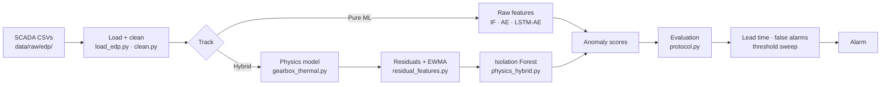
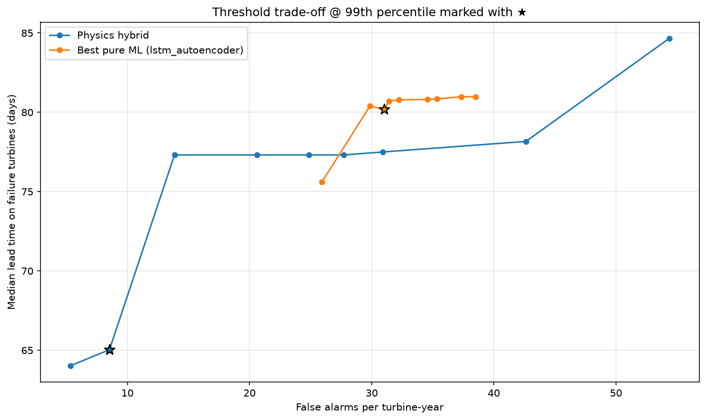
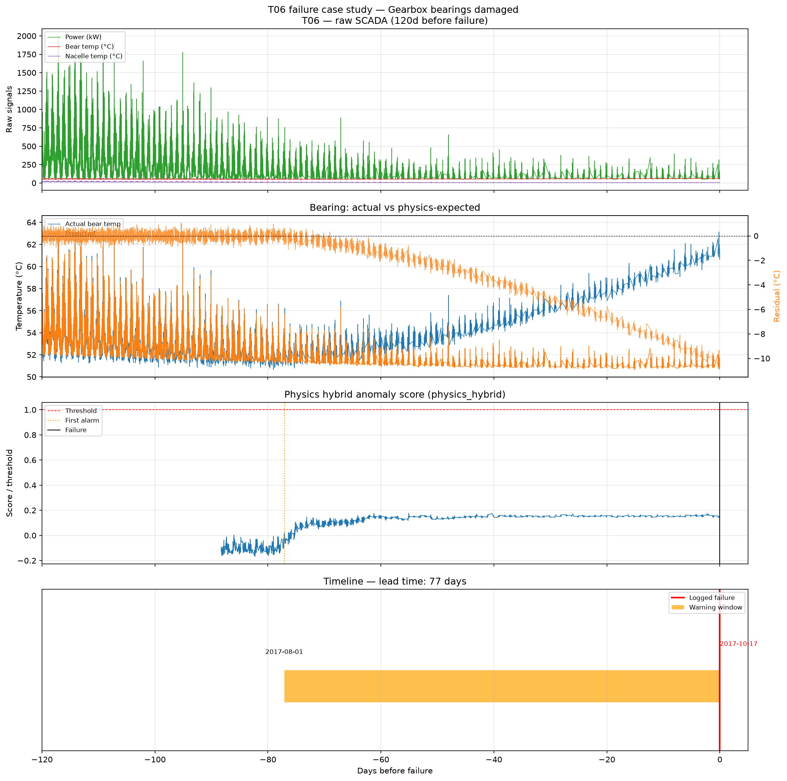

# wind-turbine-anomaly

Predict gearbox failures **N days ahead** on [EDP open wind-turbine SCADA](https://www.edp.com/en/innovation/open-data/data). Compare **pure ML anomaly detection** (Isolation Forest → autoencoder → LSTM-AE) against a **physics-residual + ML hybrid** — and show the hybrid wins on operability.

**Blog post (recruiter-facing):** [What an EE sees in turbine data that a data scientist misses](docs/BLOG.md)

## Problem

Gearbox failures are among the costliest wind-turbine events: crane mobilization, long downtime, and high replacement cost. SCADA records temperatures, power, and speeds every 10 minutes. The question is not “is this point an outlier?” but **how many days of warning** you get before a confirmed failure, and at what **false-alarm rate**.

## Pipeline



| Stage | Module | Output |
|-------|--------|--------|
| Data | `data/load_edp.py`, `data/clean.py` | Per-turbine SCADA, healthy training mask |
| Physics model | `models/gearbox_thermal.py` | Expected oil/bearing temp from power, RPM, nacelle |
| Residuals | `residual = T_pred − T_actual` | Degradation drift isolated from operating point |
| Detectors | `isolation_forest.py`, `dense_autoencoder.py`, `lstm_autoencoder.py`, `physics_hybrid.py` | Anomaly score time series |
| Evaluation | `eval/protocol.py`, `eval/threshold_sweep.py` | Lead time (days), false alarms/turbine-year |

## Approaches

| Track | Method | Role |
|-------|--------|------|
| Pure ML | Isolation Forest, dense autoencoder, LSTM-AE | Multivariate baseline on raw SCADA |
| Hybrid | Physics-informed residual + IF | Model expected gearbox temp; detect regime shifts in residuals |

See [`docs/PHYSICS_THERMAL.md`](docs/PHYSICS_THERMAL.md) for the thermal model and residual features.

## Results (synthetic EDP — regenerate locally)

Run `python scripts/run_all_ml_baselines.py` after placing data in `data/raw/edp/` (or `python scripts/generate_synthetic_edp.py --force`).

### Benchmark @ 99th-percentile threshold

| Detector | T01 lead (d) | T06 lead (d) | Median lead (d) | False alarms / turbine-year |
|----------|-------------|-------------|-----------------|----------------------------|
| Isolation Forest | 18 | 48 | — | 106 |
| Dense autoencoder | 79 | 66 | 73 | 90 |
| LSTM autoencoder | 88 | 72 | 80 | 31 |
| **Physics-residual hybrid** | **53** | **77** | **65** | **8.5** |

Ground truth: T01 gearbox pump damage (2016-07-18), T06 gearbox bearing damage (2017-10-17). Healthy turbines T07, T11 scored for false-alarm rate only.

> **Synthetic data disclaimer:** Numbers above validate the pipeline. Obtain real EDP CSVs ([data/README.md](data/README.md)) and re-run before publication or comparison to Hack the Wind literature (~21 d / ~89 d with CUSUM).

### Headline claim

> At the 99th-percentile threshold, **physics_hybrid** flags gearbox failures a median of **65 days** in advance at **8.5 false alarms per turbine-year**.

Best pure ML (LSTM-AE) at the same point: **80 days** median lead time at **31 false alarms/turbine-year**. The hybrid trades some lead time (especially T01) for a much lower false-alarm rate.

Written to `results/headline_claim.json` after each benchmark run.

### Trade-off curve



Threshold sweep (90th–99.5th percentile) in `results/threshold_sweep.csv`. The hybrid occupies the lower-left “operable” region — fewer false alarms at comparable sensitivity. ★ marks the default 99th-percentile operating point.

### Annotated failure case — T06 bearing wear-out



End-to-end annotation from `scripts/run_thermal_interpretability.py`:

1. Raw SCADA: power, bearing temp, nacelle temp
2. Actual vs predicted bearing temperature + residual drift (~−4 °C over 90 days pre-failure)
3. Physics-hybrid anomaly score with first alarm marker
4. Timeline: first alarm → logged failure (**77 days lead time**)

Sidecar: `results/interpretability/case_study_T06.json` (regenerated locally).

Additional plots after benchmark run: `results/plots/trajectory_T01.png`, `trajectory_T06.png`, `hybrid_vs_ml_comparison.png`, `residual_T06_bear.png`.

## What this means in maintenance terms

A detection system is useful only if it changes **when** you dispatch a crew — not whether a dot on a chart turns red.

### The metrics that matter

- **Lead time (days):** Days between the first sustained alarm and the logged gearbox failure. More lead time means scheduled inspection during low-wind windows, parts ordered, no emergency crane.
- **False alarms per turbine-year:** Alarms with no failure within N days (default N = 30). Each costs a truck roll and credibility with site managers.
- **Trade-off:** Lower threshold → earlier warnings, more false alarms. Maintenance planning is choosing a point on that curve.

### False-alarm economics (4-turbine fleet, ~€5k per inspection)

| Detector | False alarms / turbine-year | Fleet inspection cost / year |
|----------|----------------------------|------------------------------|
| LSTM autoencoder | 31 | ~€155k |
| **Physics-residual hybrid** | **8.5** | **~€43k** |

One avoided catastrophic gearbox failure (~€100k+) pays for roughly **20 false-alarm inspections**.

**65 days of warning** converts an unplanned crane mobilization into a planned intervention. See the [blog post](docs/BLOG.md) for the full OEM/operator narrative.

## Reproduce

```bash
git clone https://github.com/mehmetertac/wind-turbine-anomaly.git
cd wind-turbine-anomaly

python -m venv .venv
.venv\Scripts\activate          # Windows; source .venv/bin/activate on Linux/macOS
pip install -e ".[dev]"
pre-commit install

# Data — pick one
python scripts/generate_synthetic_edp.py --force   # pipeline dev (synthetic)
# OR place real EDP CSVs in data/raw/edp/ — see data/README.md

python scripts/download_edp.py --check
pytest -q

# Full benchmark: pure ML + hybrid + metrics.csv + trade-off plot
python scripts/run_all_ml_baselines.py

# Optional: thermal model, interpretability, robustness
python scripts/run_gearbox_thermal.py
python scripts/run_thermal_interpretability.py
python scripts/run_robustness_pass.py

# Notebook walkthrough (requires raw data)
jupyter notebook notebooks/01_eda_and_if_baseline.ipynb
```

### Output layout (`results/` — gitignored, regenerate after clone)

| Path | Content |
|------|---------|
| `results/metrics.csv` | Benchmark table (one row per detector) |
| `results/metrics_by_turbine.csv` | Per-turbine drill-down |
| `results/headline_claim.json` | Headline @ 99th percentile |
| `results/threshold_sweep.csv` | Full trade-off grid |
| `results/hybrid_vs_ml_summary.json` | Head-to-head deltas |
| `results/hybrid_vs_ml_regime.json` | False alarms by operating regime |
| `results/plots/` | Trajectories, trade-off curve, case study |
| `results/{detector}/` | Per-detector metrics + score parquets |

Committed figures for README/blog: `docs/assets/` (copied from latest benchmark run).

## Documentation

| Doc | Purpose |
|-----|---------|
| [Blog post](docs/BLOG.md) | EE vs data-scientist narrative (recruiter-facing) |
| [Data guide](docs/DATA.md) | Channels, turbines, gearbox failure events |
| [Physics thermal model](docs/PHYSICS_THERMAL.md) | Normal-behavior gearbox temperature |
| [Evaluation protocol](docs/EVALUATION.md) | Rolling-origin, lead time, threshold sweep |
| [Week 6 reflection](WEEK_06_REFLECTION.md) | Build summary, open questions |
| [Data acquisition](data/README.md) | EDP portal and synthetic fallback |
| [Handover](handover.md) | Session status and workflow |
| [Changelog](CHANGELOG.md) | Release notes |

## License

Apache-2.0 (see [LICENSE](LICENSE)).

## Releases

[v0.1.0](https://github.com/mehmetertac/wind-turbine-anomaly/releases/tag/v0.1.0) — first public release with full benchmark pipeline and blog post.
