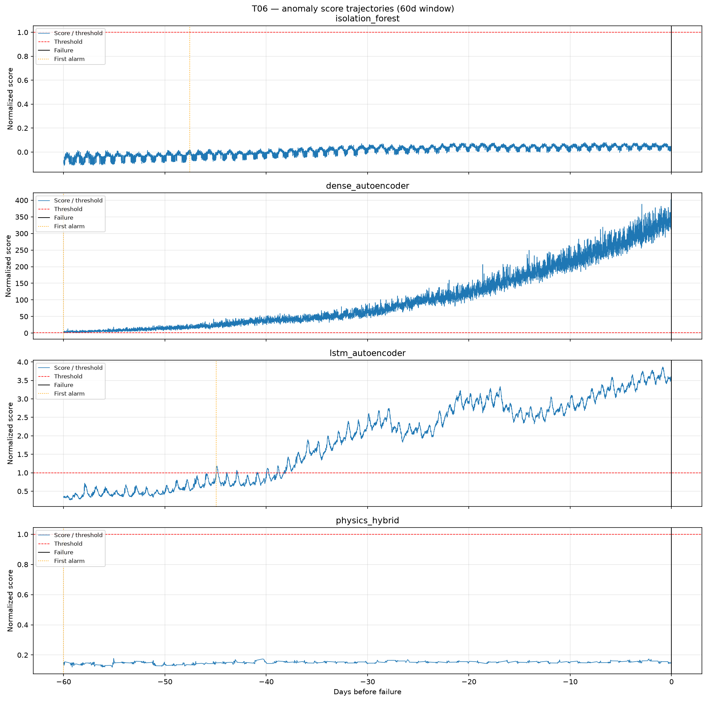
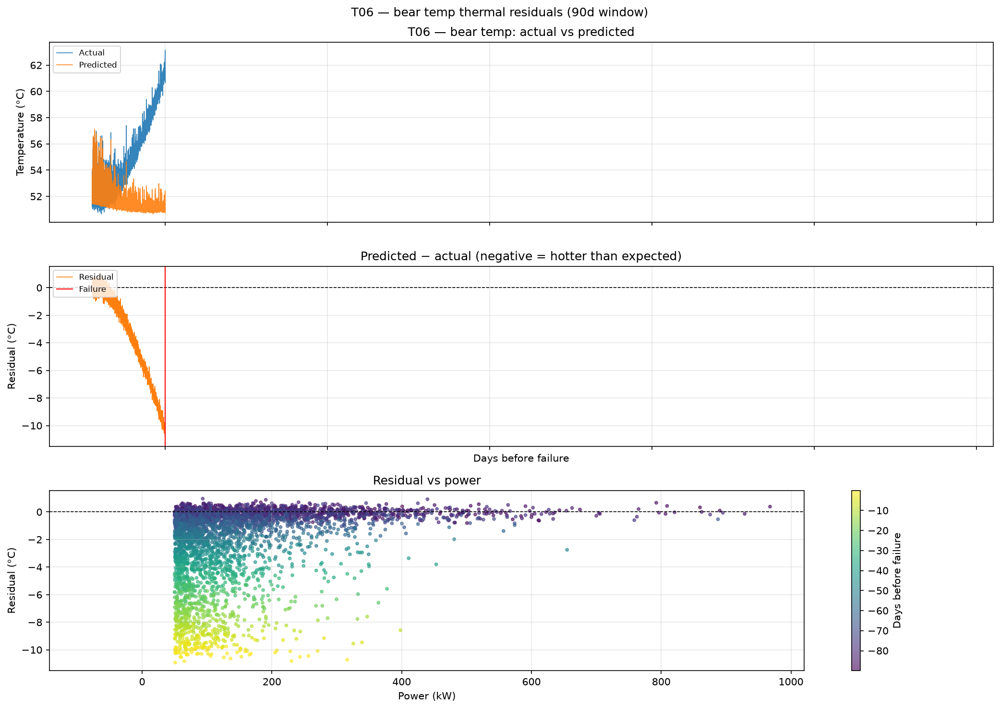
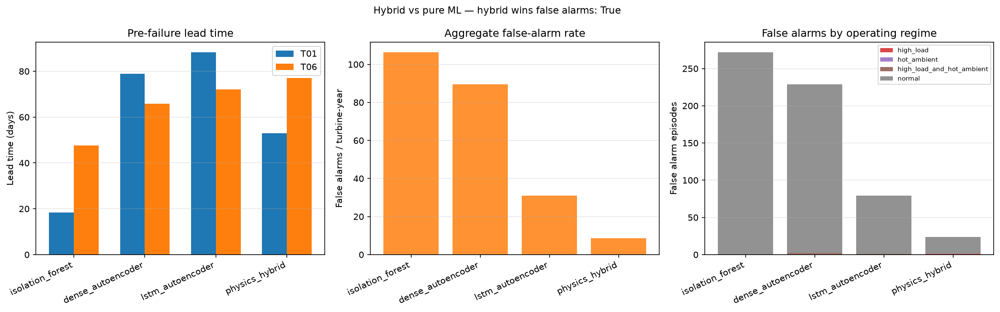

# What an EE sees in turbine data that a data scientist misses

*Gearbox failure warning on wind-turbine SCADA — a field-informed take on why physics-residual detection beats raw multivariate ML on operability.*

**Repo:** [github.com/mehmetertac/wind-turbine-anomaly](https://github.com/mehmetertac/wind-turbine-anomaly) · **Data:** [EDP Open Data](https://www.edp.com/en/innovation/open-data/data) (Wind Farm 1, 2016–2017)

---

## 1. The plot that fools a pure-ML detector

Consider turbine **T06** in the months before its logged gearbox bearing failure (17 Oct 2017). A site engineer looking at SCADA would see three familiar traces:

- **Grid power** rising and falling with wind — the turbine working hard on windy afternoons, idling overnight.
- **Gearbox bearing temperature** tracking power and nacelle interior temperature — hotter when loaded, hotter when the nacelle is warm.
- Nothing that screams "failure" on a raw temperature chart until very late.

A **pure multivariate ML detector** — here, an LSTM autoencoder trained on healthy SCADA — sees something different. It learns correlations among seven channels (gear oil and bearing temps, power, RPM, wind, nacelle temp). When the turbine runs at high load on a warm August afternoon, the joint pattern can depart from training even with **no fault present**. The reconstruction error spikes. The detector fires.



*Anomaly score trajectories on T06 (synthetic EDP replay). Pure ML (LSTM-AE) produces sustained elevated scores during high-production periods; the physics-residual hybrid isolates degradation drift.*

An EE's first question on a temperature alarm is not "is this point an outlier in seven dimensions?" It is:

> **Is this temperature proportional to what the machine should be doing right now?**

That question is the entire story.

---

## 2. The operating-point confounder

Gearbox temperature is not a fixed limit like a fuse rating. It is a **function of operating point**:

| Driver | SCADA channel | Physical meaning |
|--------|---------------|------------------|
| Load / torque | `Grd_Prod_Pwr_Avg` | Gearbox losses scale with transmitted power |
| Speed | `Rtr_RPM_Avg` | Friction and windage increase with rotor speed |
| Ambient / enclosure | `Nac_Temp_Avg` | Nacelle interior tracks ambient plus self-heating |

On a hot afternoon at rated power, bearing temperature *should* be elevated. That is healthy behavior, not degradation.

A data scientist who trains Isolation Forest or an autoencoder on raw channels without encoding this structure treats "high load + hot ambient" as a rare multivariate state. It is rare in **absolute temperature space** but common in **operating reality**. The detector cries wolf during the very periods when the asset manager is least willing to dispatch a crew — peak production hours, summer heat.

Regime analysis on our benchmark quantifies this. Across all false-alarm episodes at the default 99th-percentile threshold:

| Detector | Total false-alarm episodes | High-load ∩ hot-ambient |
|----------|---------------------------|-------------------------|
| Isolation Forest | 272 | 0 (alarms cluster post-failure / idle on T01) |
| Dense autoencoder | 229 | 2 |
| LSTM autoencoder | 79 | 1 |
| **Physics-residual hybrid** | **24** | **0** |

The hybrid does not eliminate false alarms — nothing does at useful sensitivity — but it removes the class of alarms an EE would dismiss after one glance at the power curve.

**Field intuition:** before calling a borescope team, check whether the alarm coincides with a load swing or a heat wave. If yes, wait for confirmation. Pure ML on raw SCADA cannot encode that wait.

---

## 3. The physics-residual trick

The fix is embarrassingly simple once you have the mental model:

1. **Fit a normal-behavior thermal model** per turbine on healthy history:

   ```
   T_gear ≈ T_nacelle + α·P + β·RPM + γ·P² + ε
   ```

   Separate models for oil and bearing temperature. Train only on rows with power > 50 kW (exclude idle transients). Same 90-day buffer before failure as the ML baselines — no leakage.

2. **Compute the residual:**

   ```
   residual = T_predicted − T_actual
   ```

   - **Negative residual** → hotter than expected at this operating point → friction, lubrication, or cooling problem.
   - **Positive residual** → colder than expected → sensor issue or atypical cooling, not wear.

3. **Detect on the residual stream**, not raw temperature. We use EWMA-smoothed degradation features and rolling statistics, then Isolation Forest — same alarm rule as the pure-ML baselines (99th-percentile threshold, 1-hour persistence, 24-hour cooldown).



*Predicted vs actual bearing temperature and residual on T06. Pre-failure drift of ~−4 °C over 90 days — visible in the residual, buried in raw temperature.*

SHAP analysis on the thermal model confirms what an EE expects: **power** dominates expected gearbox temperature (coefficient ≈ 3.1 °C per normalized power unit on T06 bearing model), **nacelle temperature** second, RPM minor. The model encodes the operating map; the residual carries what's left.


*Annotated failure case: raw SCADA → thermal prediction → residual drift → first alarm (1 Aug 2017) → logged failure (17 Oct 2017). **77 days lead time.***

---

## 4. The numbers: hybrid vs pure ML

We benchmark four detectors on EDP-shaped SCADA with two logged gearbox failures (T01 pump damage, T06 bearing damage) and two healthy turbines for false-alarm rate. Evaluation is strictly time-ordered: train on healthy history, score forward, measure **lead time in days** and **false alarms per turbine-year**.

> **Data note:** Metrics below were generated on a **synthetic EDP replay** (real EDP portal blocked automated download). The pipeline and evaluation protocol are production-ready; re-run on real CSVs before comparing to published Hack the Wind benchmarks (~21 d T01 / ~89 d T06 with CUSUM).

### Benchmark @ 99th-percentile threshold (default operating point)

| Detector | T01 lead (days) | T06 lead (days) | Median lead | False alarms / turbine-year |
|----------|-----------------|-----------------|-------------|----------------------------|
| Isolation Forest | 18 | 48 | — | 106 |
| Dense autoencoder | 79 | 66 | 73 | 90 |
| LSTM autoencoder | 88 | 72 | **80** | 31 |
| **Physics-residual hybrid** | 53 | **77** | **65** | **8.5** |

**Headline:** At the same threshold percentile, the hybrid delivers **65 days median warning at 8.5 false alarms per turbine-year**. Best pure ML (LSTM-AE) delivers **80 days at 31 false alarms** — more lead time on T01, comparable on T06, but nearly **4× the false-alarm rate**.

The trade-off is not "hybrid always wins on lead time." It wins on **operability**: enough warning horizon for planned intervention, with far fewer unnecessary truck rolls.


*Lead time vs false-alarm rate as threshold varies (90th–99.5th percentile). ★ = default 99th-percentile operating point. Hybrid dominates the lower-left "operable" region.*

At **90th percentile** (more sensitive): hybrid median lead time rises to ~85 days but false alarms jump to ~54/turbine-year — still below LSTM-AE's ~38 at the same percentile. Threshold selection is a maintenance economics problem, not a leaderboard problem.



---

## 5. What this means for OEM and operator economics

A detection system is useful only if it changes **when** you mobilize — not whether a dot turns red.

### Cost anchors (indicative, European onshore)

| Event | Typical cost | Scheduling |
|-------|-------------|------------|
| Emergency gearbox replacement + crane | €50k–150k + weeks downtime | Unplanned; wind-window constrained |
| Planned inspection (borescope, oil sample) | €3k–8k | Low-wind window |
| Planned gearbox replacement | ~€100k | Crane booked in advance |

### Translating metrics to euros (4-turbine fleet, acting on every alarm)

Assume ~€5k per false-alarm inspection (truck roll + lost production from conservative curtailment):

| Detector | False alarms / turbine-year | Fleet inspection cost / year |
|----------|----------------------------|------------------------------|
| LSTM autoencoder | 31 | ~€155k |
| **Physics-residual hybrid** | **8.5** | **~€43k** |

One avoided catastrophic gearbox failure (~€100k+) pays for roughly **20 false-alarm inspections**. The break-even question is not "zero false alarms" but whether avoided failures and reduced emergency mobilizations dominate inspection spend.

**65 days of warning** converts an unplanned crane call into a planned intervention: pull an oil sample during the next low-wind week, confirm metal or viscosity trend, order parts, book the crane for a known window. That is the OEM/operator value proposition — not AUROC on a held-out scatter plot.

### Who should care

- **Asset managers** pick a point on the trade-off curve based on site access, crane availability, and fleet age — not the threshold that maximizes Kaggle score.
- **OEM analytics teams** can ship physics-residual layers on top of existing SCADA pipelines without new sensors — power and nacelle temp are already wired.
- **Data science hires** who understand operating-point confounders and residual thinking reduce the cycle from "model fires constantly" to "site manager trusts the alarm."

---

## Reproduce

```bash
git clone https://github.com/mehmetertac/wind-turbine-anomaly.git
cd wind-turbine-anomaly
python -m venv .venv && .venv\Scripts\activate   # Windows
pip install -e ".[dev]"

python scripts/generate_synthetic_edp.py --force   # or place real EDP CSVs in data/raw/edp/
python scripts/run_all_ml_baselines.py
python scripts/run_thermal_interpretability.py   # case study + SHAP plots
```

Full protocol: [docs/EVALUATION.md](EVALUATION.md). Physics model: [docs/PHYSICS_THERMAL.md](PHYSICS_THERMAL.md).

---

## Closing

The gap between a data scientist and an EE on turbine SCADA is not Python versus field experience. It is **whether the detector asks the right question**.

Raw multivariate ML asks: *"Have I seen this combination of sensor values before?"*

An EE asks: *"Given what this turbine is doing right now, should it be this hot?"*

Encode the second question — with a simple thermal model and a residual — and the false-alarm rate drops while the warning horizon stays in the range maintenance planners can act on. That is the difference between a demo and a system a site manager will pick up the phone for.

---

*Project: [wind-turbine-anomaly v0.1.0](https://github.com/mehmetertac/wind-turbine-anomaly/releases/tag/v0.1.0) · License: Apache-2.0*
